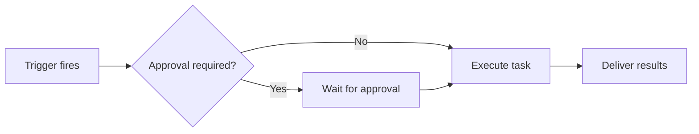

Workflows are automated routines that run without you having to do anything. Define a task once, and Dimension runs it for you — on a schedule or when something happens in your tools.

## How to create a workflow

You can create workflows from the **Workflows** page or by asking Dimension in chat:

- "Create a workflow that summarizes my emails every morning"
- "Set up a workflow that posts a Slack message when a Vercel deployment fails"

A workflow has a few parts:
- **Prompt** — What you want Dimension to do, written in plain language
- **Integrations** — Which tools the workflow can use
- **Schedule or trigger** — When it should run

## How workflows execute

## Workflow types

<Tabs>
  <Tab title="Scheduled">
    Run at set times — daily, weekdays, weekly, or custom.

    **Examples:**
    - Every weekday at 9 AM — summarize unread emails
    - Every Monday at 8 AM — weekly sprint summary
    - Every Friday at 5 PM — weekly accomplishment recap
  </Tab>
  <Tab title="Triggered">
    Run automatically when something happens in your tools.

    | Integration | Triggers |
    |-------------|----------|
    | **Gmail** | New email (filter by label) |
    | **Slack** | New DM, new message in a channel |
    | **Google Calendar** | Before or after a calendar event |
    | **Vercel** | Deployment failed or succeeded |
    | **Linear** | Cycle started/ended, issue created |
    | **GitHub** | PR opened |
    | **Airtable** | New records added |
    | **Google Sheets** | New rows added |
    | **Stripe** | Customer created, invoice paid/failed, payment succeeded, checkout completed |

    All triggers support filters so you can narrow down when the workflow fires (e.g., only specific Slack channels, repos, or labels).
  </Tab>
</Tabs>

## Example workflows

| Trigger | What Dimension does |
|---------|-------------------|
| New email from a client | Summarize the email and create a todo |
| Vercel deployment failed | Post failure details to Slack and create a Linear issue |
| GitHub PR opened | Review the changes and post a summary comment |
| Calendar event in 15 minutes | Prepare meeting briefing notes |

## Notifications

When a workflow finishes, Dimension notifies you through your preferred channel — email, Slack, iMessage, or push notification. You can change your preferred channel in **Settings**. Email is the default.

You can also tell Dimension where to send results directly in the workflow prompt — e.g. "...and post the summary in #general on Slack" — as long as that integration is connected.

## Approvals

Workflows can run fully automatically, or you can require approval before Dimension takes sensitive actions — just like approvals in chat.

<Warning>Disabling approvals means workflows will take actions (like sending emails or posting messages) without asking first. Only disable approvals for workflows you've thoroughly tested.</Warning>

## Marketplace

Browse and install pre-built workflows from the marketplace, organized by role (Engineering, Product, Marketing, Sales, etc.). You can also publish your own workflows for others to use.

<Tip>The Marketplace is a great way to get started — find a workflow close to what you need and customize it.</Tip>
